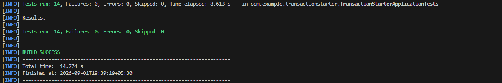
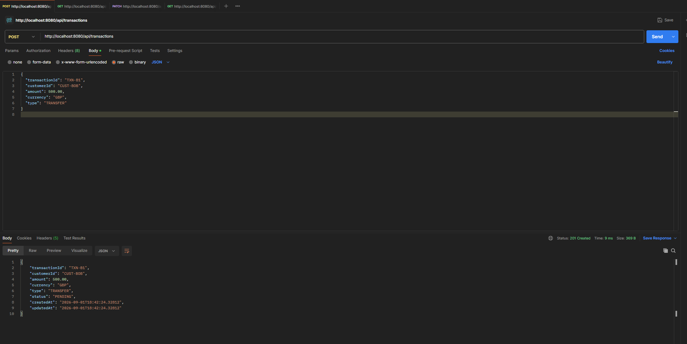
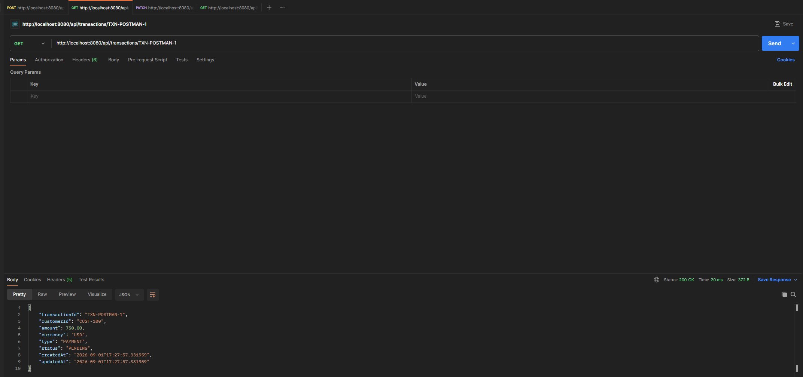
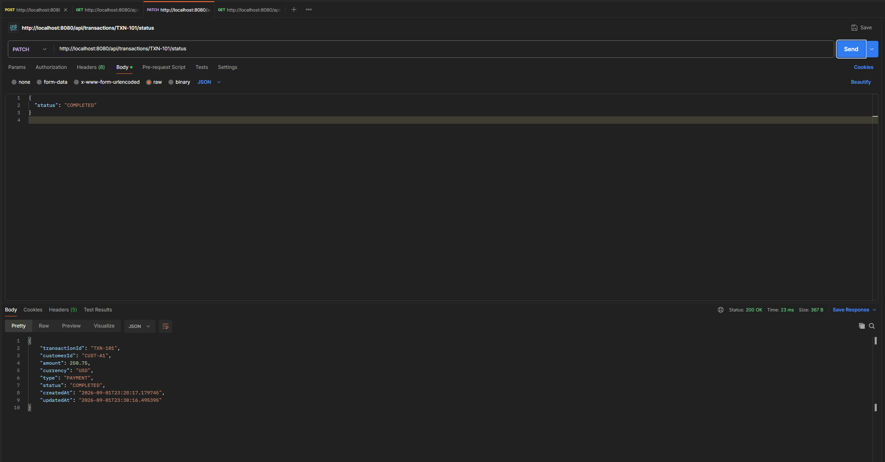
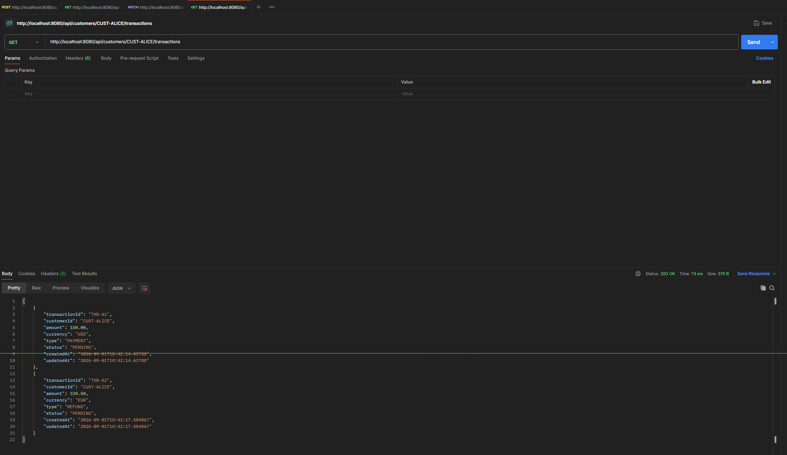

# Transaction Starter — Toucan Payments Engineering Challenge

A small transaction-processing service built on the provided Spring Boot starter, implementing the four required operations: create, get by ID, update status, and get by customer.

---

## Getting Started & How to Run

### 1. Run the Automated Test Suite
No Maven or external database installation is required. Execute the Maven wrapper directly:
- **Windows (PowerShell / CMD)**:
  ```powershell
  .\mvnw.cmd clean test
  ```
- **macOS / Linux**:
  ```bash
  ./mvnw clean test
  ```

### 2. Run the Application Locally
- **Windows**:
  ```powershell
  .\mvnw.cmd spring-boot:run
  ```
- **macOS / Linux**:
  ```bash
  ./mvnw spring-boot:run
  ```
- **Base URL**: `http://localhost:8080`
- **H2 Web Console**: `http://localhost:8080/h2-console` (JDBC URL: `jdbc:h2:mem:transactions`, Username: `sa`, Password: *(leave blank)*)

---

## Understanding of the Problem

The service manages customer transactions, each with a Transaction ID, Customer ID, Amount, Currency, Transaction Type, and Transaction Status. The assignment deliberately leaves package structure, entity design, validation, error handling, endpoint design, and testing approach undefined — those decisions, and the reasoning behind them, are the actual point of the exercise, not just getting four endpoints to respond.

---

## Assumptions & Variant Specifications

The following variant specifications and business rules were defined and implemented for this service:

- **Allowed currencies:** `USD`, `EUR`, `GBP`, `INR`
- **Allowed transaction types:** `PAYMENT`, `REFUND`, `TRANSFER`
- **Maximum amount:** `1,000,000.00`
- **Additional validation rule:** Amount must have at most 2 decimal places (no fractional cents)

---

## Validation Rules

### On Create:
- `transactionId` and `customerId` are required, non-blank strings
- `amount` is required, must be greater than 0 (`>= 0.01`), capped at `1,000,000.00`, and limited to at most 2 decimal places (`@Digits(integer=17, fraction=2)`)
- `currency` must be one of the allowed set (`USD`, `EUR`, `GBP`, `INR`)
- `type` must be one of the allowed set (`PAYMENT`, `REFUND`, `TRANSFER`)
- `transactionId` must not already exist — duplicates are rejected with HTTP 409 Conflict, not overwritten
- Initial `status` is forced to `PENDING` by the service and cannot be spoofed by client input

### On Status Update:
- The target status must be a valid enum value
- The transition from the transaction's current status to the requested status must be on the allowed state machine list
- A same-status update (e.g. `PENDING → PENDING`) is explicitly rejected with HTTP 400 rather than silently accepted as a no-op

---

## Status Transition Rules & Reasoning

```
PENDING   → COMPLETED
PENDING   → FAILED
COMPLETED → REFUNDED
```

`FAILED` and `REFUNDED` are terminal states — no transitions are allowed out of them. 

**Reasoning**: A transaction starts `PENDING` and resolves exactly once, either to `COMPLETED` or `FAILED`. A `COMPLETED` transaction can later be `REFUNDED` (money returned), but there is no real-world meaning to "un-failing" or "un-refunding" a settled financial transaction through this endpoint. Allowing such arbitrary transitions would permit clients to silently rewrite settled ledger history.

---

## API Endpoints

| Method | Path | Purpose | Success Status |
|---|---|---|---|
| `POST` | `/api/transactions` | Create a transaction | `201 Created` |
| `GET` | `/api/transactions/{transactionId}` | Get a transaction by ID | `200 OK` |
| `PATCH` | `/api/transactions/{transactionId}/status` | Update a transaction's status | `200 OK` |
| `GET` | `/api/customers/{customerId}/transactions` | Get all transactions for a customer | `200 OK` |

### Error Response Format
All errors return a standardized JSON structure with appropriate HTTP status codes:
```json
{
  "error": "Conflict",
  "message": "Transaction with ID TXN-1001 already exists"
}
```
- **400 Bad Request**: Validation failures, scale errors, invalid status transitions, or same-status update attempts.
- **404 Not Found**: Requesting or updating a non-existent transaction ID.
- **409 Conflict**: Submitting a duplicate transaction ID on create.
- **500 Internal Server Error**: Fallback handler for unexpected system exceptions.

---

## How Testing Was Approached

Tests use `@SpringBootTest` with `MockMvc`, exercising the complete HTTP request-response lifecycle: controller mapping, `@Valid` Bean Validation, service layer logic, custom domain exceptions via `@RestControllerAdvice`, and persistence against the embedded H2 database.

**14 automated integration tests** cover:
1. Context loads successfully
2. API 1: Create transaction happy path (`201 Created`)
3. API 2: Get transaction by ID happy path (`200 OK`)
4. API 3: Update status happy path (`200 OK`)
5. API 4: Get customer transactions happy path (`200 OK` with list)
6. Negative amount validation failure (`400 Bad Request`)
7. Duplicate transaction ID rejection (`409 Conflict`)
8. Amount exceeding 2 decimal places rejection (`400 Bad Request`)
9. Non-existent transaction ID lookup (`404 Not Found`)
10. Disallowed transition from terminal state `FAILED → COMPLETED` (`400 Bad Request`)
11. Disallowed same-status transition `PENDING → PENDING` (`400 Bad Request`)
12. Disallowed direct jump `PENDING → REFUNDED` (`400 Bad Request`)
13. Update status on non-existent transaction (`404 Not Found`)
14. Customer transaction lookup for non-existent customer returning empty list (`200 OK` `[]`)

### Visual Execution & Verification Evidence











Verified with `.\mvnw.cmd clean test` from a clean state (14/14 passing), manual verification via Postman, and table inspections in the H2 Web Console.

---

## Known Limitations

- **H2 In-Memory Only**: Data resets when the application stops; there is no persistent relational database (e.g., PostgreSQL) backing this service.
- **One-Way Transaction Flow & Manual Confirmation**: Transactions are currently modeled as a single-sided record rather than a double-entry financial ledger. Confirmation and status updates are triggered manually via API rather than through asynchronous payment gateway webhooks or external banking networks.
- **No Authentication / Authorization**: There are no user accounts, JWT tokens, or RBAC controls; any client can view or mutate any customer's transaction.
- **No Concurrency Control**: Simultaneous status updates for the same transaction record lack optimistic locking (`@Version` field) to prevent lost-update race conditions.
- **No Pagination / Filtering**: `GET /api/customers/{customerId}/transactions` returns all records at once, which could degrade performance with thousands of transactions per customer.
- **No Distributed Event Architecture**: State transitions happen synchronously within the request thread without publishing domain events for downstream accounting or auditing.

---

## What I'd Improve with More Time

- **Persistent Production Database**: Migrate to PostgreSQL with Flyway database migrations for durable storage and ACID compliance.
- **Two-Way Double-Entry Ledger & User Accounts**: Introduce distinct sender and receiver accounts, authenticated users with roles, and enforce double-entry debit/credit ledgering.
- **Asynchronous Event-Driven Architecture (Apache Kafka)**: Use Kafka message brokers to handle payment processing asynchronously, verifying transactions through background worker services and updating status via event streams rather than synchronous manual PATCH requests.
- **Optimistic Locking & Concurrency Protection**: Add `@Version` fields to the `Transaction` JPA entity to ensure concurrent status transitions are serialized safely.
- **Pagination & Query Filters**: Add Spring Data `Pageable` support (`page`, `size`, `sort`) and filters (by status, date range, currency) on customer lookups.
- **Idempotency Keys**: Accept `Idempotency-Key` headers on `POST /api/transactions` to protect against network retries creating unintentional duplicate orders.
- **OpenAPI / Swagger Documentation**: Integrate SpringDoc OpenAPI 3 for interactive API documentation and testing.
- **Additional Extended APIs**: Add endpoints for batch transfers, transaction cancellation, dispute/chargeback workflows, and webhook notifications for third-party consumers.
